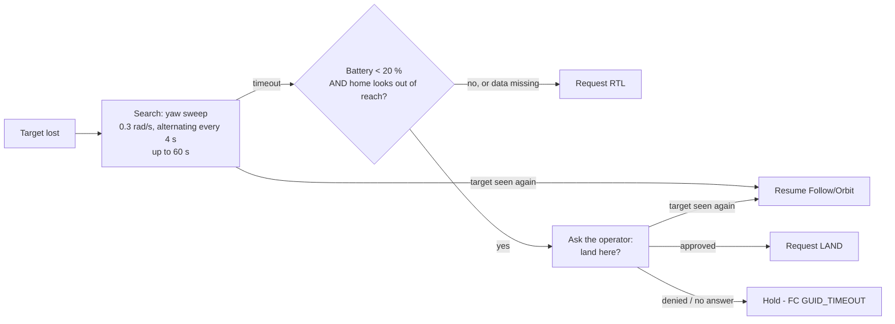

# Guidance Modes

Every mode below only **proposes** a body-frame velocity command (forward vx, right vy, down vz, yaw rate). The [Safety Supervisor](Safety-Architecture#the-supervisor-gate) decides whether it reaches the flight controller, and nothing is ever sent unless the FC is in `GUIDED`.

Modes are chosen in the app (`mode_command`):

| Mode | `mode` value | Needs a target | Needs GPS |
|---|---|---|---|
| Normal RC (idle) | `idle` | - | - |
| Track | `tracking` | yes | - |
| Follow | `follow` | yes | - |
| Orbit | `orbit` | yes | - |
| Approach-Test | `approach` | yes | - |
| Grid Search | `grid_search` | no | yes (3D fix, HDOP ≤ 2.5) |

Selecting Follow, Orbit, Approach or Grid Search makes the Pi request `GUIDED` automatically - unless the pilot is moving the sticks, the FC is already in `GUIDED`, or MAVLink is not connected. The request is confirmed, retried and reported ([MAVLink Integration](MAVLink-Integration#flight-mode-requests-are-confirmed)).

## Track

Vision only. The target is tracked and shown; no commands are sent.

## Follow

`companion/guidance/follow.py`. Keeps a set distance behind the target and keeps it centred.

| Axis | Driven by |
|---|---|
| Forward (vx) | Distance error vs. `target_separation_m` (default 6 m, range 3-15 m), PID. Reverse limited to 1.0 m/s. Zero when distance is unknown. |
| Sideways (vy) | Always 0 |
| Yaw rate | Horizontal pixel offset of the target from image centre (20 px deadband) |
| Vertical (vz) | Keeps the target vertically centred in frame, **or** holds an absolute altitude when `follow_altitude_m` is set |

Limits applied to every command:

- Speed ≤ `max_speed_mps` (3.0 m/s). The app's speed slider can lower it live, down to 0.5 m/s, never above the config ceiling.
- Acceleration ≤ `max_accel_mps2` (1.5 m/s²) via a slew limiter, so a re-lock or distance jump never becomes a velocity step.
- Altitude floor 2 m / ceiling 30 m: descent through the floor or climb through the ceiling is refused. With no fresh altitude reading, descent is suppressed.
- A taught (Teach mode) target is capped at 1.5 m/s.

A controller that did not run on a frame (hold, RC override, SAFE, takeoff climb) is reset, so it ramps up from standstill when it resumes. A frame gap over 0.5 s resets it too.

## Orbit

`companion/guidance/orbit.py`. Circles the target - the "point of interest" shot.

| Axis | Driven by |
|---|---|
| Forward (vx) | Distance error vs. `orbit_radius_m` (default 8 m, range 3-20 m) |
| Sideways (vy) | Tangential speed = `angular_speed_dps` (15 °/s) × current distance, direction +1 or -1 |
| Yaw rate | Keeps the target centred |
| Vertical (vz) | Framing, or absolute altitude when `orbit_altitude_m` is set |

Same speed, acceleration and altitude limits as Follow.

## Holding

During Follow and Orbit the drone holds still (zero velocity, reported as `guidance_hold`) when:

| `guidance_hold` | Why |
|---|---|
| `target_unseen` | Target not seen for ≥ 0.3 s |
| `identity_lost` | The tracked box no longer looks like the chosen target |
| `auto_takeoff` | Climbing after Arm & Follow |
| `gps_degraded` | Grid Search without a fresh, good GPS fix (no command at all) |
| `takeoff_refused_gps` / `takeoff_refused_battery` | Arm & Follow refused to climb |

## Arm & Follow (auto-takeoff)

`companion/guidance/auto_takeoff.py`. The app's **Arm & Follow** sends `mode_command` with `auto_takeoff: true`. Instead of chasing the target from the ground:

1. Wait until the FC is **armed and in GUIDED** (all guidance withheld).
2. Check GPS (fix type ≥ 3, HDOP ≤ 2.5) and battery (> 30 %). If either is bad, refuse, return to idle, and tell the operator why.
3. Send one `MAV_CMD_NAV_TAKEOFF` to **10 m**; ArduCopter climbs on its own. If the command could not be sent (link being reopened), it is asked for again next frame.
4. When altitude is within 1 m of target, start following that same frame.
5. If the whole sequence exceeds **30 s**, give up and return to idle.

## Grid Search

`companion/guidance/grid_search.py`. A systematic "lawnmower" sweep of an area, for search and surveillance.

1. Fly to one corner of the area manually.
2. In the app set width and height (20-200 m) and start. Heading defaults to the aircraft's current heading.
3. The Pi plans a GPS waypoint route from the current position: legs 15 m apart, as one continuous path.
4. It turns toward each waypoint (yaw PID), moves forward only once within 25° of it, and advances when within 3 m. Search speed is 2.5 m/s.
5. When finished it returns to idle by itself (`grid_search_finished`).

No target is needed, so it is exempt from the target-lost check. It refuses to start, or holds, without a fresh 3D fix with HDOP ≤ 2.5. The route and progress stream to the app's flight map (`grid_search_update`).

## Target-loss recovery

`companion/guidance/target_recovery.py`. Only for **Follow and Orbit**, when the target reaches `TARGET_LOST`:

- The search is a real guidance mode (`SEARCHING`), so every Supervisor gate still applies.
- **RTL is the default.** Missing GPS, home or battery data always means RTL.
- "Out of reach" uses assumed constants (5 m/s return speed, 900 s flight time, ×1.5 margin). These are placeholders to tune from real flights.
- **Landing is never automatic.** It needs an explicit approval for that specific request.
- RTL is suppressed if the pilot has stick override at that moment.
- Changing to any mode other than Follow/Orbit, or STOP, cancels the search.

## Approach-Test

`companion/guidance/approach_test.py`. A **controlled experiment only**: a slow approach to a designated, benign test fixture in a controlled environment - never a general collision system. Flight-testing it needs its own separate go/no-go review.

- Approach speed ≤ 1.0 m/s.
- Stops at `min_boundary_m` (2 m) or on a contact-sensor signal → `STOPPED_AT_BOUNDARY` (holds).
- Aborts on **any** of: target not currently tracked (any miss), operator link lost, RC override, geofence breach → `ABORTED`.
- Both end states are **sticky** until the operator restarts or leaves the mode - a boundary event needs a conscious decision.

## STOP / Abort

The app's STOP button (any tab) immediately:

- sets the mode to idle, stops the tracker, forgets the target's appearance and any pending selection;
- cancels Grid Search, auto-takeoff and any recovery search;
- commands **BRAKE** on the FC (stop and hold position), unless the pilot is already moving the sticks.

The Pi never re-engages `GUIDED` after STOP on its own. The operator does that deliberately (switch or app) before choosing a new mode.

## Live parameter changes

Sent in `mode_command` and clamped to config bounds; non-finite values are ignored:

| Field | Clamped to |
|---|---|
| `follow_separation_m` | 3-15 m |
| `follow_altitude_m`, `orbit_altitude_m` | 2-30 m |
| `orbit_radius_m` | 3-20 m |
| `follow_max_speed_mps`, `orbit_max_speed_mps` | 0.5 m/s - config max |
| `grid_search_width_m`, `grid_search_height_m` | 20-200 m |

PID state resets only when a mode is freshly entered, not on every parameter update.
