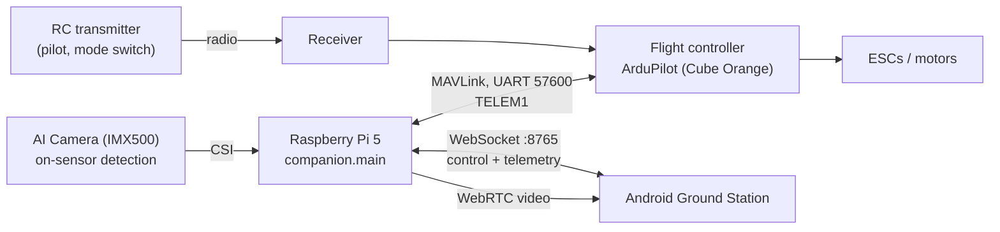
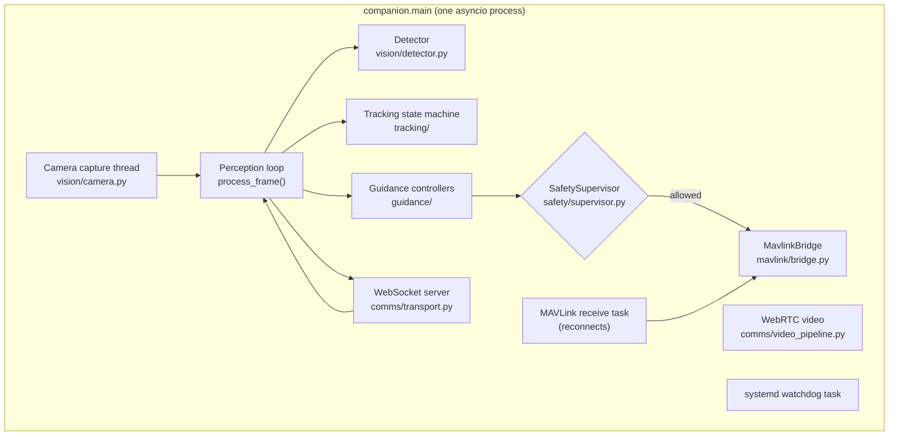

# System Architecture

## The three boxes

| Box | Role | Authority |
|---|---|---|
| **Flight controller** (ArduPilot) | Flies the aircraft. Runs its own failsafes (radio, battery, fence, `GUID_TIMEOUT`). | The only flight authority. |
| **Raspberry Pi 5 + AI Camera** | Detects, tracks, estimates distance, and *proposes* velocity setpoints. Relays telemetry to the phone. | Advisory only. Its setpoints are obeyed only while the FC is in `GUIDED`. |
| **Android app** | Live video, target selection, mode buttons, STOP, telemetry, health, alerts. | Operator interface. Never talks to the FC directly. |

The pilot's transmitter reaches the flight controller through the receiver. That path never touches the Pi, so flipping the mode switch always works: Pi running, frozen, crashed or powered off.

## One process on the Pi

Everything on the Pi is a single Python asyncio process, `python -m companion.main`, run by systemd as `ai-vision-drone`. It is built around `CompanionOrchestrator` in `companion/main.py`.

Long-running tasks:

| Task | What it does |
|---|---|
| Camera capture thread | Pulls frames plus their AI result from the IMX500 on its own daemon thread, so a hung camera cannot freeze the event loop. |
| Perception loop | Runs `process_frame()` once per camera frame: the whole detect → track → guide → gate → send cycle, plus every message to the app. |
| MAVLink receive task | Reads FC messages into a telemetry snapshot; reopens the link after errors or silence. |
| MAVLink heartbeat | Sends the companion's own heartbeat once a second. |
| WebSocket server | Accepts the app. Each client has its own send queue and writer task, so a slow phone never stalls the loop. |
| WebRTC video | Serves the camera image to the app over a separate peer connection. |
| systemd watchdog | Pings systemd only while frames keep flowing. |

## What happens every frame

`process_frame()` runs these steps in order. The order matters: every safety input is gathered before the Supervisor decides.

1. Beat the `camera` watchdog; relay any arm/disarm result and confirm or retry any pending flight-mode request.
2. Write the frame to the local recording if recording.
3. **Detections.** Parse the AI result. A frame with *no* AI result reuses the last real detections for up to 0.5 s ([details](Vision-and-Detection#frames-without-an-ai-result)).
4. Start Teach mode if a teach request is pending.
5. Apply a pending operator selection (only on a frame with a real AI result).
6. **Tracking.** Update the tracker, or *coast* on a frame with no AI result; try appearance-based re-lock if the target is lost; check the tracked box is still the same person.
7. **Distance** to the target, median-filtered.
8. **RC override** check; if the pilot moves the sticks while in `GUIDED`, request `LOITER` once.
9. Operator-link liveness, obstacle proximity, home position request on arming.
10. **Target-loss recovery** (Follow/Orbit only) and **auto-takeoff** sequencing.
11. **Failsafe RTL** check (operator link lost 15 s or battery critical).
12. **Supervisor** decides if guidance is allowed ([gate order](Safety-Architecture#the-supervisor-gate)).
13. The active controller computes a command, or a zero-velocity **hold** if the target has been unseen for 0.3 s.
14. Send the setpoint to the FC if allowed.
15. Send `tracking_update`, `detections_update`, `grid_search_update`, `telemetry`, `health` (and `recording_state`) to the app.

A frame gap over 0.5 s is treated as a stall: controllers restart from standstill instead of using a huge time step.

## Commands are proposals

Every guidance controller (Follow, Orbit, Approach-Test, Grid Search, the recovery search) returns a `GuidanceCommand` (body-frame vx, vy, vz, yaw rate). None of them touch MAVLink. `SafetySupervisor.evaluate()` is the single place that decides whether a command reaches `MavlinkBridge.send_velocity_setpoint()`, and the bridge re-checks the permission as a backstop.

Administrative commands (arm/disarm, set flight mode, takeoff, RTL on failsafe, BRAKE on STOP) go straight to the FC like a normal ground station would send them. The FC's own checks guard those.

## Offline by design

No internet connection is needed to fly:

- The Pi runs its own Wi-Fi access point (SSID `ai-vision-drone`), and the phone joins it directly. The access point itself is set up at the OS level; `network.yaml`'s `mode`/`ssid` keys document it but no code reads them.
- WebSocket control and WebRTC video are LAN-only; WebRTC uses no STUN/TURN servers.
- Detection runs on the camera sensor; there is no cloud inference.
- MAVLink is a wired serial link.
- The Android app has no analytics or cloud SDKs.

Internet is only needed for one-time setup: flashing, `pip install`, `git clone`, the first Gradle build.

## Technology

| Area | Choice |
|---|---|
| Companion language | Python 3.11+ (3.12 used in development), asyncio |
| Camera / AI | Raspberry Pi AI Camera, Sony IMX500, `picamera2`; default model SSD MobileNetV2 FPN-Lite 320x320 (COCO) |
| Flight controller | ArduPilot ArduCopter (tested on CubePilot Cube Orange) via `pymavlink` |
| Control channel | WebSockets (`websockets` library), JSON envelopes |
| Video | WebRTC via `aiortc` (software encode, default); a GStreamer hardware-encode pipeline exists but is unverified |
| Tracking | Custom IoU tracker with an alpha-beta motion filter (default) or a ByteTrack-style tracker; OpenCV trackers for Teach mode |
| App | Kotlin, Jetpack Compose, OkHttp WebSocket, `stream-webrtc-android`; minSdk 26, targetSdk 34 |
| Service | systemd, `Type=notify` with a watchdog |
