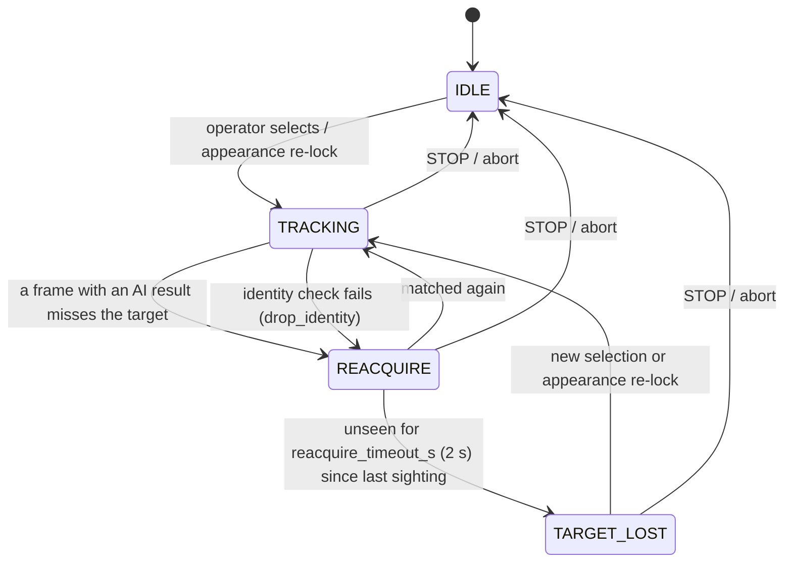

# Tracking and Target Selection

## Selecting a target

The operator picks a target on the Fly tab. The Pi never tracks the raw touch rectangle; it snaps the selection to a real detection (`companion/tracking/target_selector.py`):

| Gesture | Message | Matching |
|---|---|---|
| **Tap** | `target_select {x, y, point: true}` | The detection box containing the point; if several contain it, the **smallest** (tapping a person in front of a car picks the person) |
| **Drag** | `target_select {x, y, w, h}` | The detection with the highest overlap (IoU ≥ 0.1) |

Coordinates are in the video's native pixels (1280x720). A new selection always takes effect, whatever the current tracking state. It is applied on the next frame that carries a real AI result; if nothing matches, it is dropped.

On selection the Pi also records the target's **appearance** (a colour histogram) for identity checks and re-locking.

## Tracking states

`TrackingStateMachine` (`companion/tracking/state.py`) owns one target's life cycle:

- **TRACKING** - the target was matched on this frame, or recently enough.
- **REACQUIRE** - briefly unseen. The last box is kept, but guidance steers on it only for 0.3 s (see below).
- **TARGET_LOST** - gone for 2 s, measured from the **last sighting**. The target is cleared, so stale coordinates are never used again. The Supervisor refuses Follow/Orbit/Approach, and Follow/Orbit start [target-loss recovery](Guidance-Modes#target-loss-recovery).
- Frames with **no AI result** do not advance the tracker (`coast()`); they only let an existing REACQUIRE timeout run out.

## Trackers

Selected with `hardware.yaml` → `tracker.impl`. Both are single-target and share the motion model.

| Tracker | `impl` | How it associates |
|---|---|---|
| `IouKalmanTracker` (default) | `iou` | Overlap (IoU ≥ 0.3) between detections of the same class and the predicted box. Confirmed on real hardware. |
| `ByteTrackTracker` | `bytetrack` | Two-stage: first high-confidence detections (≥ 0.6), then low-confidence "byte" detections (≥ 0.1), so a briefly blurred or occluded target is recovered instead of missed. Unit-tested, not yet run on hardware. |
| `VisualObjectTracker` | automatic in Teach mode | OpenCV CSRT/KCF/MIL tracker on pixels, for objects the detector has no class for. See [Teach Mode](Teach-Mode). |

### Motion model

`companion/tracking/motion.py`: a constant-velocity **alpha-beta filter** on the box centre (α 0.7, β 0.3) and an exponential average on its size.

- Velocity is bounded relative to the target's size (10 box-sizes per second), so one 6 px wobble does not read as 180 px/s of phantom motion.
- Prediction coasts for at most 0.5 s.
- After a gap, matching tries both the coasted prediction and the last-seen position - a target hidden behind something may have kept walking or stopped.
- Near-tied overlaps (two people crossing) go to the nearer centre instead of a coin flip.

Each tracked target carries two boxes:

- `bbox` - the raw detection, drawn in the app exactly as the detector saw it.
- `guidance_bbox` - the filtered box, used for guidance and distance so detector jitter does not become command jitter.

## Identity check while tracking

Overlap alone cannot tell two similar people apart when they cross. `AppearanceMemory` (`companion/tracking/appearance.py`) compares the tracked box with the remembered appearance on every frame that has a real AI result:

| Situation | Action |
|---|---|
| Similarity ≥ `track_min_similarity` (0.30) | Fine; the mismatch counter resets |
| Mismatch for `track_swap_frames` (5) frames **and** another same-class detection matches the remembered look | Switch to that detection (`identity_swap_corrected`) |
| Mismatch for `track_drop_frames` (20) frames with no good alternative | Drop the lock to REACQUIRE (`identity_lost`); guidance **holds immediately** with `identity_lost` |

The remembered signature adapts slowly, only on strong matches (≥ 0.80, rate 0.10), so lighting drift does not erode a correct lock and a wrong box can never contaminate it. The check needs real pixels, so it does nothing in sim mode.

## Appearance re-lock after loss

Once `TARGET_LOST`, each fresh detection of the same class is compared with the remembered appearance. A confident match (similarity ≥ 0.65, and ≥ 0.08 better than the runner-up) re-locks the target automatically (`appearance_reacquired`), with no re-tap needed. STOP forgets the appearance, so nothing re-locks after an abort.

## Holding when the target is unseen

While unseen, the tracker still holds the last known box. Follow and Orbit:

- **keep steering on it only while it is younger than `target_hold_after_unseen_s` (0.3 s)** - so a single missed detection does not make the drone stutter;
- then command a **zero-velocity hold** (`guidance_hold: target_unseen`) until the target is genuinely seen again.

The age is measured from the last sighting, whatever the state. A TRACKING target whose AI results have stopped arriving is held too. A target judged to be the wrong person is held immediately. Approach-Test is stricter: any miss aborts it.

## Known limits

- Appearance is a colour histogram, not a learned embedding. Two people in similar clothing can still be confused, which is why an unresolved mismatch *stops* instead of guessing.
- Thresholds are conservative starting values, not yet tuned on real multi-person footage.
- Reacquisition metrics (≥90 % reacquired, ≤5 % false-lost) can be measured from a recorded session with `tools/detection_regression.py analyze`; not yet run on real data.
